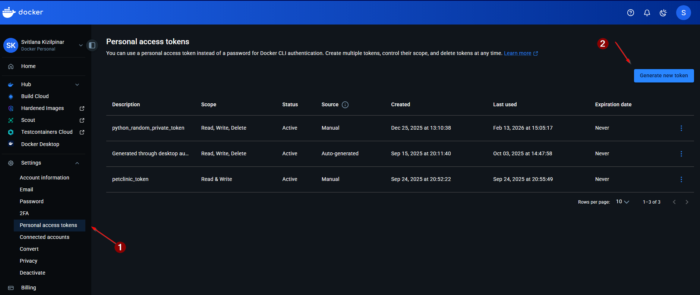
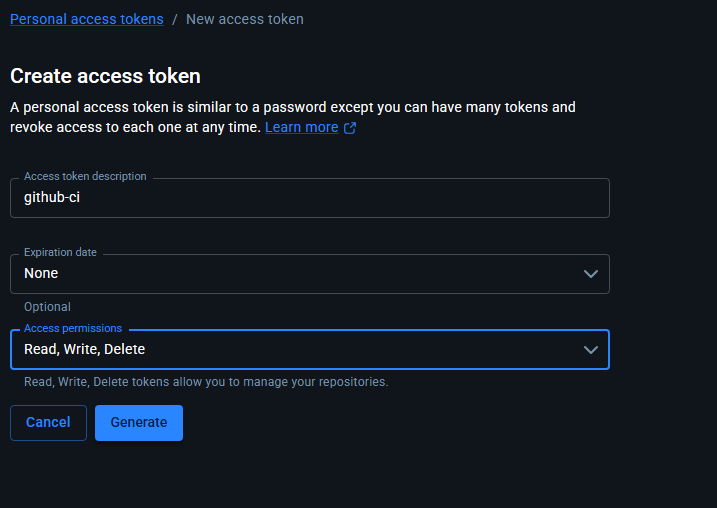
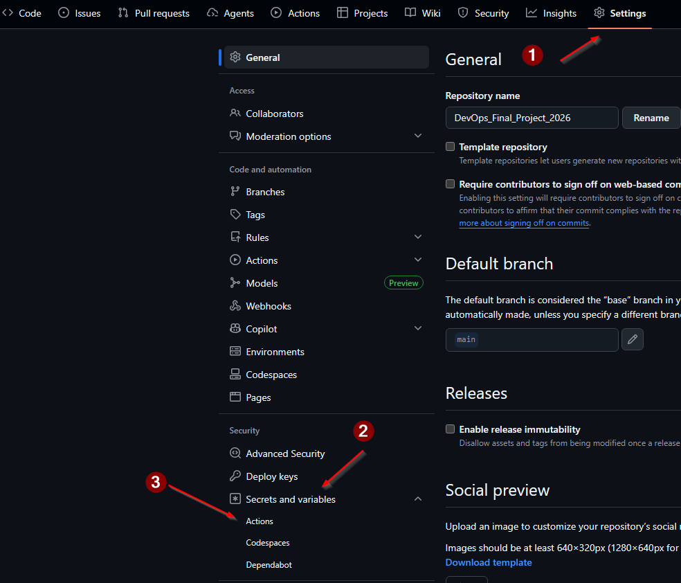
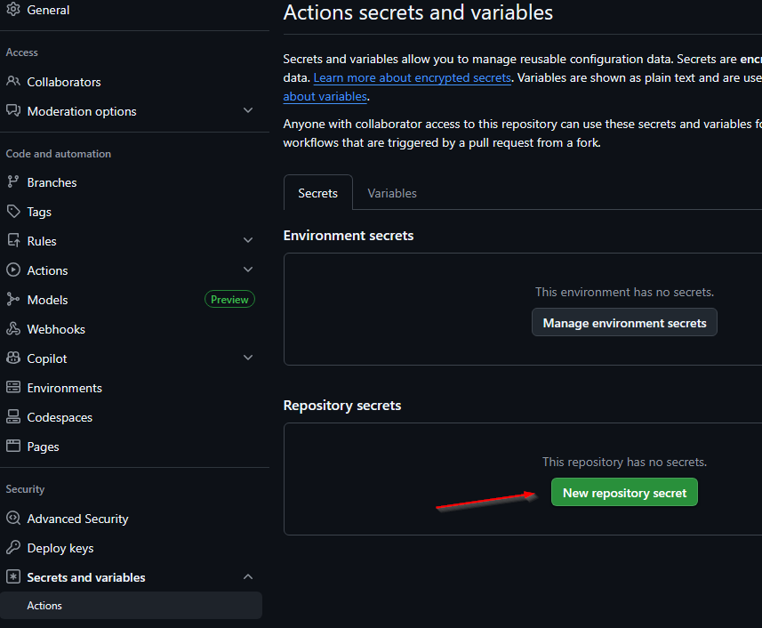
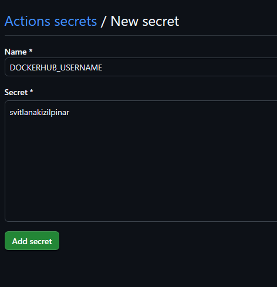
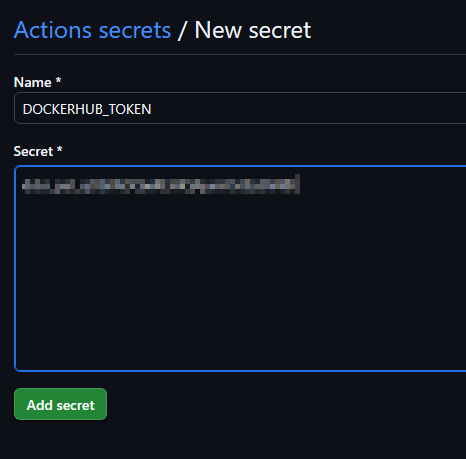
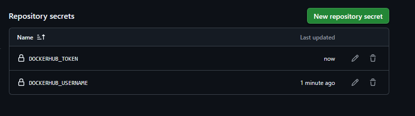
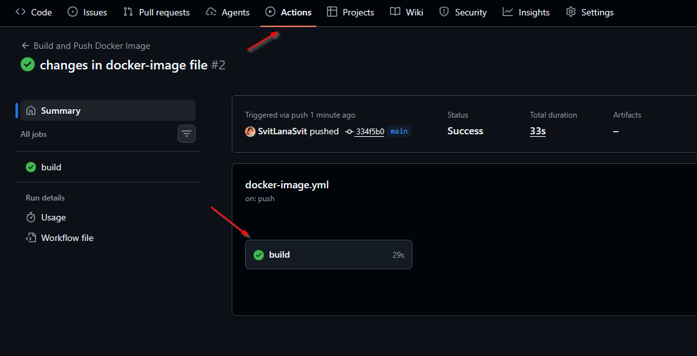
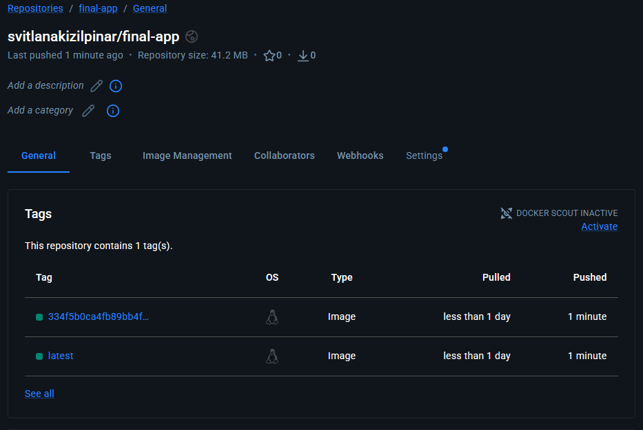

# GitHub Actions: збірка і push Docker-образу

## Призначення

Цей етап автоматизує збірку Docker-образу для Python backend та публікацію його в Docker Hub при кожному пуші в гілку `main`.

## Локація workflow

Файл GitHub Actions знаходиться за шляхом:
- `.github/workflows/docker-image.yml`

## Тригери

```yaml
on:
  push:
    branches: [ main ]
```

Workflow запускається автоматично при кожному `git push` у гілку `main`.

## Необхідні секрети репозиторію

### 1. Створення Docker Hub Access Token

У Docker Hub (Account Settings → Security) створюється Access Token, який буде використовуватись GitHub Actions для логіну.

Скріншоти:
- 
- 

### 2. Додавання секретів у GitHub

У GitHub (Settings → Secrets and variables → Actions) створено два секрети:
- `DOCKERHUB_USERNAME` — логін на Docker Hub (наприклад, `svitlanakizilpinar`);
- `DOCKERHUB_TOKEN` — Access Token з Docker Hub.

Скріншоти створення секретів у GitHub:
- 
- 
- 
- 
- 

Вони використовуються в кроці логіну до Docker Hub:

```yaml
- name: Log in to Docker Hub
  uses: docker/login-action@v3
  with:
    username: ${{ secrets.DOCKERHUB_USERNAME }}
    password: ${{ secrets.DOCKERHUB_TOKEN }}
```

## Основні кроки workflow

1. **Checkout репозиторію**
   ```yaml
   - name: Checkout code
     uses: actions/checkout@v4
   ```
   Клонує код поточного коміту в робочу директорію runner'а.

2. **Логін у Docker Hub** — див. блок вище.

3. **Налаштування Docker Buildx**
   ```yaml
   - name: Set up Docker Buildx
     uses: docker/setup-buildx-action@v3
   ```
   Готує розширений builder для збірки образів.

4. **Збірка та push Docker-образу**
   ```yaml
   - name: Build and push
     uses: docker/build-push-action@v5
     with:
       context: .
       push: true
       tags: |
         svitlanakizilpinar/final-app:latest
         svitlanakizilpinar/final-app:${{ github.sha }}
   ```
   - `context: .` — збірка з кореня репозиторію, де лежить `Dockerfile`.
   - `push: true` — після збірки образ пушиться в Docker Hub.
   - `tags` — образ отримує два теги:
     - `latest` — остання версія;
     - `${{ github.sha }}` — унікальний тег за SHA коміту (для відстеження версій).

## Результат

Після успішного виконання workflow в акаунті Docker Hub з'являється репозиторій:
- `svitlanakizilpinar/final-app`

Для кожного успішного пуша в `main` додаються нові теги образу:
- `latest` (оновлюється);
- довгий тег з SHA коміту.

Ці образи будуть використані далі в Kubernetes Deployment та керуватись через ArgoCD.

Скріншоти результату в Docker Hub:
- 
- 