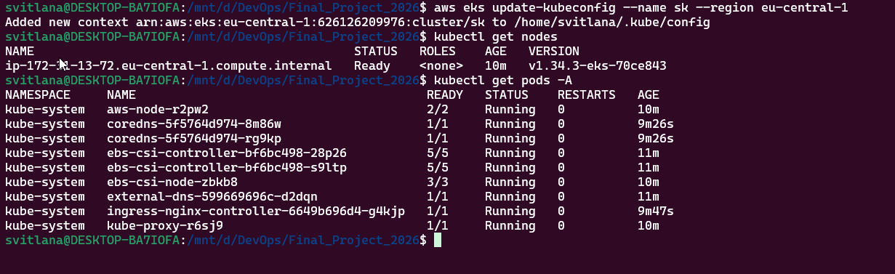

# Пункт 2. EKS-кластер через Terraform

Цей розділ описує, як був виконаний пункт 2 завдання:

> Використайте Terraform для створення EKS-кластера … одна node group з одним node; встановлений nginx ingress controller.

## 1. Вихідні коди Terraform

Код для EKS знаходиться в каталозі:

- `terraform/EKS`

Основні файли:
- `backend.tf` – зберігання Terraform state у S3 bucket.
- `provider.tf` – налаштування AWS‑провайдера.
- `variables.tf` – змінні (імʼя кластера, VPC, subnets, Route53 zone тощо).
- `terraform.tfvars` – конкретні значення змінних для мого акаунта.
- `eks-cluster.tf` – ресурс `aws_eks_cluster`.
- `eks-worker-nodes.tf` – ресурс `aws_eks_node_group` з однією node group і однією нодою.
- `iam.tf` – IAM‑ролі та політики для кластера й нод.
- `sg.tf` – security group для кластера.
- `acm.tf` – ACM‑сертифікат для домену `sk.devops10.test-danit.com` і Route53‑записи для валідації.
- `ingress_controller.tf` – nginx ingress controller.
- `eks-external-dns.tf` – external-dns для автоматичного створення DNS‑записів у Route53.
- `ebs-csi.tf` – драйвер EBS CSI для роботи з EBS‑томами.

## 2. Налаштування змінних (terraform.tfvars)

У файлі `terraform/EKS/terraform.tfvars` я задала свої значення:

```hcl
# AWS account config
region = "eu-central-1"

# Загальний префікс для ресурсів
name = "sk"

# Default VPC та її сабнети в моєму акаунті
vpc_id      = "vpc-0e9ce6f45b6762d99"
subnets_ids = [
  "subnet-...", # сабнет у eu-central-1a
  "subnet-...", # сабнет у eu-central-1b
  "subnet-..."  # сабнет у eu-central-1c
]

tags = {
  Environment = "dev"
  TfControl   = "true"
  Owner       = "svitlana.kizilpinar@gmail.com"
}

# Route53 hosted zone, видана куратором
zone_name = "devops10.test-danit.com"
```

- `name = "sk"` використовується як префікс для імен кластера (`sk`), security group (`sk-eks-sg`), IAM‑ролей (`sk-eks-role`, `sk-eks-node`) та тегів.
- `vpc_id` та `subnets_ids` – це **default VPC та три її subnets** у регіоні `eu-central-1`, як рекомендував куратор.
- `zone_name` вказує на наявну Route53 hosted zone, в якій ACM і external-dns створюють записи для `argocd.sk.devops10.test-danit.com` і `app.sk.devops10.test-danit.com`.

## 3. MFA та робота з AWS з Ubuntu

Для безпечної роботи з AWS використовується MFA‑скрипт, який отримує тимчасові STS‑креденшіали й записує їх у профіль `default` AWS CLI.

### 3.1. Підготовка скрипта в Ubuntu

У WSL/Ubuntu я перейшла в директорію проєкту та виправила переноси рядків у скрипті (бо він був створений у Windows):

```bash
cd /mnt/d/DevOps/Final_Project_2026
sed -i 's/\r$//' mfa/dan-it-aws-login.sh
chmod +x mfa/dan-it-aws-login.sh
```

### 3.2. Запуск MFA-скрипта

Перед роботою з Terraform/EKS я виконую:

```bash
./mfa/dan-it-aws-login.sh
```

Скрипт:
- використовує базовий профіль з постійними access key/secret key;
- запитує код з MFA‑додатку;
- отримує тимчасові STS‑креденшіали через `aws sts get-session-token`;
- записує їх у профіль `default` (`aws configure set ...`).

Після цього всі команди `aws` і `terraform`, які використовують `default` профіль, працюють з MFA‑захищеною сесією.

## 4. Створення EKS-кластера через Terraform в Windows

Після налаштування змінних і MFA я виконала стандартну послідовність команд у каталозі `terraform/EKS`:

```bash
cd terraform/EKS
terraform init
terraform plan
terraform apply
```

- `terraform init` – ініціалізація backend у S3 і завантаження модулів.
- `terraform plan` – перевірка, що буде створено ~41 ресурс (EKS, node group, ingress, external-dns, ebs-csi, ACM тощо).
- `terraform apply` – фактичне створення всіх ресурсів. Процес займає кілька хвилин, поки EKS‑кластер, ACM‑сертифікати та інші частини переходять у стан `ACTIVE`.

Результат успішного застосування:

```text
Apply complete! Resources: 41 added, 0 changed, 0 destroyed.
```

## 5. Перевірка кластера з Ubuntu

Після успішного `terraform apply` я підключилась до EKS‑кластера з Ubuntu (WSL):

1. Оновила kubeconfig:

```bash
aws eks update-kubeconfig --name sk --region eu-central-1
```

2. Перевірила ноди й поди:

```bash
kubectl get nodes
kubectl get pods -A
```

Очікуваний результат:
- `kubectl get nodes` – одна нода в статусі `Ready`.
- `kubectl get pods -A` – системні поди (`aws-node`, `coredns`, `kube-proxy`), pod-и драйвера EBS CSI, `external-dns` і `ingress-nginx-controller` в статусі `Running`.

Скріншот з результатом команд `aws eks update-kubeconfig`, `kubectl get nodes` і `kubectl get pods -A` доданий у папку `screens`:



## 6. Висновок по пункту 2

У результаті цього етапу:
- створено EKS‑кластер `sk` у регіоні `eu-central-1` на базі default VPC;
- налаштована одна node group з однією нодою;
- встановлений nginx ingress controller, external-dns і ebs-csi driver;
- кластер успішно доступний з Ubuntu через `kubectl`, всі системні поди в статусі `Running`.