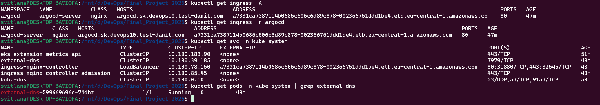
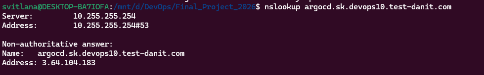
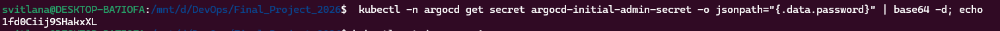
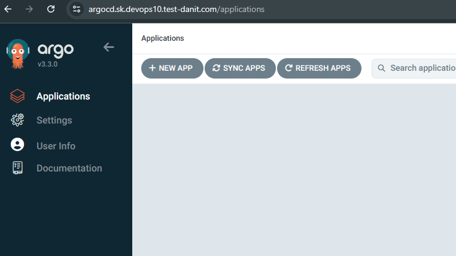

# Крок 3. Встановлення ArgoCD (Argo Continuous Delivery) в EKS через Terraform

У цьому кроці я додала до вже існуючої інфраструктури EKS (Elastic Kubernetes Service) установку ArgoCD (Argo Continuous Delivery) за допомогою Terraform (IaC – Infrastructure as Code) і Helm.

ArgoCD буде доступний за HTTPS‑адресою:

- `https://argocd.sk.devops10.test-danit.com`

Цей домен лежить у тій самій зоні Route53 (Amazon Route 53 – DNS сервіс AWS), що й інші піддомени: `devops10.test-danit.com`.

---

## 1. Terraform (IaC – Infrastructure as Code) конфігурація для ArgoCD

Файл: `terraform/EKS/argocd.tf`

Головні елементи:

- `locals.argocd_hostname = "argocd.${local.domain_name}"`
  - `local.domain_name` вже визначений в `acm.tf` як `"${var.name}.${var.zone_name}"`, тобто `sk.devops10.test-danit.com`.
  - Отже, `argocd_hostname = argocd.sk.devops10.test-danit.com`.

- `resource "helm_release" "argocd"` – Helm‑чарт (Helm – пакетний менеджер для Kubernetes), який встановлює ArgoCD у кластер EKS:
  - `repository = "https://argoproj.github.io/argo-helm"`
  - `chart = "argo-cd"`
  - `namespace = "argocd"`, `create_namespace = true` – створюється окремий namespace (Namespace – логічна область в Kubernetes) для компонентів ArgoCD.

- Налаштування Ingress (Ingress – об’єкт Kubernetes для HTTP(S) доступу до сервісів):
  - Увімкнення ingress для ArgoCD:
    - `server.ingress.enabled = true`
  - Використання nginx Ingress Controller (встановлений раніше в `ingress_controller.tf`):
    - `server.ingress.ingressClassName = nginx`
  - Налаштування глобального домену для ArgoCD:
    - `global.domain = argocd.sk.devops10.test-danit.com`
  - Вказання hostname (FQDN – Fully Qualified Domain Name) безпосередньо для Ingress ArgoCD:
    - `server.ingress.hostname = argocd.sk.devops10.test-danit.com`

- Налаштування протоколу всередині кластера:
  - `server.extraArgs[0] = "--insecure"`
  - Це означає, що ArgoCD сервер слухає HTTP всередині кластера, а TLS (Transport Layer Security – шифрування HTTPS) завершується на рівні AWS NLB (Network Load Balancer) з використанням сертифіката від ACM (AWS Certificate Manager).

- `depends_on = [...]` – гарантує, що ArgoCD встановиться тільки після того, як будуть готові:
  - сам кластер `aws_eks_cluster.danit`,
  - node group `aws_eks_node_group.danit`,
  - nginx Ingress Controller `helm_release.nginx_ingress`.

---

## 2. Деплой ArgoCD у кластер EKS через Terraform

Команди запускались у каталозі `terraform/EKS` після того, як EKS уже був створений (крок 2).

1. Спочатку оновити тимчасові облікові дані через AWS MFA, як описано в `docs/1_aws-mfa-login.md` (запустити скрипт MFA і переконатися, що `aws sts get-caller-identity` працює).

2. Оновити/переконфігурувати Terraform (якщо потрібно):

```bash
terraform init
terraform plan
terraform apply
```

Після `terraform apply` Terraform створює всі необхідні Kubernetes‑ресурси через Helm:

- namespace `argocd`;
- pod’и ArgoCD (server, repo‑server, application‑controller, dex, redis);
- service (Service – об’єкт Kubernetes для доступу до pod’ів) `argocd-server` типу `ClusterIP`;
- ingress `argocd-server` з host `argocd.sk.devops10.test-danit.com`.

Скріншот перевірки встановлення ArgoCD через Terraform:

- 

---

## 3. Автоматичне створення DNS‑записів external-dns (External DNS Controller)

External-dns (External DNS Controller – контролер, який керує DNS‑записами в Route53) був вже встановлений на кроці 2 (`eks-external-dns.tf`) і налаштований на домен `devops10.test-danit.com`.

Коли з’явився новий Ingress з host `argocd.sk.devops10.test-danit.com`, external-dns автоматично:

- знайшов Ingress із цим host;
- створив у Route53:
  - A‑запис для `argocd.sk.devops10.test-danit.com` на адресу AWS ELB/NLB,
  - TXT‑записи, потрібні для роботи external-dns.

Приклад логів external-dns, де видно створення цих записів:

- 

---

## 4. Підключення до кластера EKS і перевірка pod’ів ArgoCD

Ці дії виконувались у WSL/Ubuntu з використанням AWS CLI та kubectl (Kubernetes CLI – командний інструмент для Kubernetes).

1. Отримати тимчасові облікові дані через AWS MFA (Multi‑Factor Authentication), як описано у `docs/1_aws-mfa-login.md`.
2. Оновити kubeconfig (Kubernetes configuration – конфіг для доступу до кластерів):

```bash
aws eks update-kubeconfig --name sk --region eu-central-1
```

3. Перевірити pod’и в namespace `argocd`:

```bash
kubectl get pods -n argocd
```

Очікуваний результат – усі pod’и ArgoCD у статусі `Running`.

Скріншот перевірки pod’ів ArgoCD:

- 

---

## 5. Отримання початкового пароля admin для ArgoCD

Після встановлення ArgoCD Helm‑чарт створює секрет (Secret – об’єкт Kubernetes для зберігання чутливих даних) `argocd-initial-admin-secret` з початковим паролем користувача `admin`.

Команда для отримання пароля (пароль base64‑декодується і виводиться в термінал):

```bash
kubectl -n argocd get secret argocd-initial-admin-secret \
  -o jsonpath="{.data.password}" | base64 -d; echo
```

- `jsonpath` – дозволяє витягнути тільки поле `data.password` з секрету;
- `base64 -d` – декодує пароль із формату Base64.

Скріншот отримання початкового пароля admin:

- 

Цей пароль надалі використовується для першого входу в веб‑інтерфейс ArgoCD.

---

## 6. Доступ до ArgoCD по HTTPS через NLB і ACM

Після того, як external-dns створив DNS‑записи, а AWS NLB (Network Load Balancer) отримав TLS‑сертифікат з ACM (AWS Certificate Manager), веб‑інтерфейс ArgoCD став доступний з Інтернету.

1. У браузері відкривається сторінка:

- `https://argocd.sk.devops10.test-danit.com`

2. На першому кроці з’являється форма логіну ArgoCD:

- Username: `admin`
- Password: значення, отримане з секрету `argocd-initial-admin-secret`.

3. Після успішного входу відображається головна сторінка ArgoCD з пустим списком застосунків (Applications).

Скріншот успішного входу в ArgoCD:

- 

---

## 7. Підсумок кроку 3

На цьому етапі реалізовано наступне:

- ArgoCD (Argo Continuous Delivery) встановлено в кластер EKS (Elastic Kubernetes Service) за допомогою Terraform (IaC) і Helm;
- налаштований HTTPS‑доступ до ArgoCD за доменом `argocd.sk.devops10.test-danit.com` через nginx Ingress Controller, AWS NLB (Network Load Balancer) та ACM (AWS Certificate Manager);
- external-dns (External DNS Controller) автоматично створює DNS‑записи в Route53 (Amazon Route 53) для піддомену ArgoCD;
- отриманий початковий пароль користувача `admin` і виконано успішний вхід у веб‑інтерфейс ArgoCD.

Ця інфраструктура буде використана на наступних кроках для створення ArgoCD Application, яке буде розгортати мій застосунок (Python backend з пункту 1) в EKS автоматично за GitOps‑підходом.
