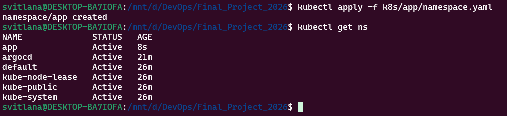
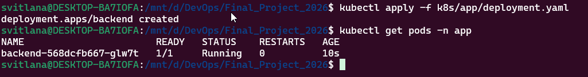
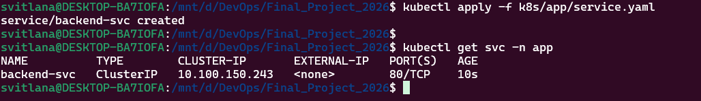
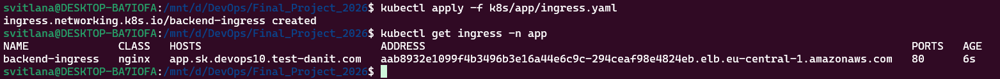
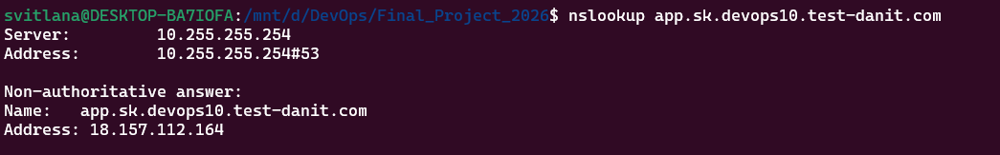
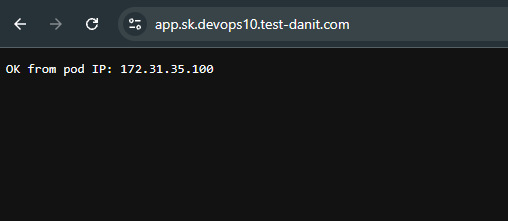

# Крок 4. Деплой Python backend у EKS через Kubernetes-маніфести

У цьому кроці я розгорнула свій Python backend (Docker-образ із пункту 1) **безпосередньо в EKS**, використовуючи «чисті» Kubernetes-маніфести:

- Namespace `app`;
- Deployment `backend`;
- Service `backend-svc` (ClusterIP);
- Ingress `backend-ingress` з доменом `app.sk.devops10.test-danit.com`.

---

## 1. Структура маніфестів у репозиторії

Я створила окрему папку для Kubernetes-маніфестів застосунку:

- `k8s/app/namespace.yaml`
- `k8s/app/deployment.yaml`
- `k8s/app/service.yaml`
- `k8s/app/ingress.yaml`

Ці файли описують усе, що потрібно, щоб запустити backend у кластері EKS та зробити його доступним з Інтернету через nginx Ingress Controller і AWS NLB.

---

## 2. Namespace `app`

Файл: `k8s/app/namespace.yaml`

Namespace (простір імен) `app` ізольовує ресурси мого застосунку від системних pod’ів (`kube-system`, `argocd` тощо).

Створення namespace:

```bash
kubectl apply -f k8s/app/namespace.yaml
kubectl get ns
```

Скріншот, де видно namespace `app` поряд з іншими:

- 

---

## 3. Deployment `backend`

Файл: `k8s/app/deployment.yaml`

Deployment описує pod із контейнером мого Docker-образу з Docker Hub:

- образ: `svitlanakizilpinar/final-app:latest` (збирається GitHub Actions);
- порт у контейнері: `8000`;
- змінна оточення `PORT=8000` для Python-сервера;
- `imagePullPolicy: Always`, щоб pod завжди тягнув найсвіжіший образ `latest`.

Деплоймент:

```bash
kubectl apply -f k8s/app/deployment.yaml
kubectl get pods -n app
```

Очікуваний результат — pod `backend-...` у статусі `Running` в namespace `app`.

Скріншот подів у namespace `app`:

- 

> Примітка про невеликий кластер
> 
> Кластер має лише одну ноду, на якій уже працюють системні pod’и, ArgoCD, ingress-nginx, external-dns і ebs-csi. Через це при оновленні Deployment (rolling update) Kubernetes іноді не може тимчасово розмістити одночасно старий і новий pod і новий pod потрапляє в `Pending` з помилкою `Too many pods`. У такому випадку я видаляла старий pod вручну (`kubectl delete pod ... -n app`), або можна було б задати стратегію `maxSurge: 0, maxUnavailable: 1` для Deployment.

---

## 4. Service `backend-svc`

Файл: `k8s/app/service.yaml`

Service типу `ClusterIP` відкриває доступ до pod’а всередині кластера і забезпечує стабільне ім’я/порт для Ingress:

- `selector: app=backend` — сервіс знаходить pod’и Deployment’у;
- `port: 80` — порт сервісу, на який буде дивитися Ingress;
- `targetPort: 8000` — порт усередині контейнера Python backend.

Створення сервісу:

```bash
kubectl apply -f k8s/app/service.yaml
kubectl get svc -n app
```

Скріншот створеного сервісу `backend-svc`:

- 

---

## 5. Ingress `backend-ingress` і HTTPS-доступ до `app.sk.devops10.test-danit.com`

Файл: `k8s/app/ingress.yaml`

Ingress маршрутизує HTTP(S)-запити від nginx Ingress Controller (який слухає за NLB) до сервісу `backend-svc`:

- `ingressClassName: nginx` — використовує вже встановлений nginx Ingress Controller;
- `host: app.sk.devops10.test-danit.com` — FQDN для мого застосунку;
- маршрут `/` → сервіс `backend-svc`, порт `80`.

Створення ingress:

```bash
kubectl apply -f k8s/app/ingress.yaml
kubectl get ingress -n app
```

У виводі `kubectl get ingress -n app` видно:

- `HOSTS`: `app.sk.devops10.test-danit.com`;
- `ADDRESS`: ім’я AWS ELB/NLB (`...elb.eu-central-1.amazonaws.com`).

Скріншот створеного Ingress’а:

- 

---

## 6. DNS-перевірка домену `app.sk.devops10.test-danit.com`

DNS-записи для Ingress створює external-dns (налаштований у пункті 2). Після створення Ingress з host `app.sk.devops10.test-danit.com` external-dns додає в Route53 A/TXT-записи для цього домену.

Я перевірила, що DNS працює, за допомогою `nslookup` у WSL/Ubuntu:

```bash
nslookup app.sk.devops10.test-danit.com
```

Очікуваний результат — IP-адреса балансувальника AWS:

```text
Non-authoritative answer:
Name:   app.sk.devops10.test-danit.com
Address: 18.157.112.164
```

Скріншот перевірки DNS для `app.sk.devops10.test-danit.com`:

- 

---

## 7. Перевірка доступу до застосунку з браузера

Після того, як DNS почав повертати IP-адресу NLB, я відкрила в браузері адресу:

- `https://app.sk.devops10.test-danit.com`

У відповідь я отримала сторінку з текстом мого Python backend’а, де виводиться IP pod’а, з якого прийшла відповідь, наприклад:

```text
OK from pod IP: 172.31.35.100
```

Скріншот результату в браузері (Windows):

- 

Щоб показати, що це саме внутрішній IP pod’а в кластері, я також зробила скріншот команди `kubectl get pods -n app -o wide`, де в колонці **IP** видно ту саму адресу `172.31.35.100` у VPC:

- 

---

## 8. Підсумок кроку 4

На цьому етапі я:

- створила окремий namespace `app` для мого бекенду;
- описала Deployment, Service і Ingress у вигляді Kubernetes-маніфестів у каталозі `k8s/app`;
- розгорнула Python backend у кластері EKS і зробила його доступним з Інтернету за доменом `app.sk.devops10.test-danit.com` через nginx Ingress Controller, AWS NLB і ACM;
- переконалась, що DNS-записи для цього домену створюються external-dns, а сторінка з відповіддю бекенду відкривається в браузері.

Ці самі маніфести будуть використані на наступному кроці для налаштування ArgoCD Application, щоб ArgoCD самостійно застосовував їх у кластері за GitOps-підходом (без ручних `kubectl apply`).
