# Крок 5. ArgoCD Application та авто‑синхронізація backend'а

У цьому кроці я налаштувала **ArgoCD Application**, який:

- читає Kubernetes‑маніфести мого застосунку з GitHub‑репозиторію (каталог `k8s/app` з кроку 4);
- автоматично застосовує їх у кластері EKS (GitOps‑підхід);
- **автоматично оновлює** Deployment при зміні маніфестів (наприклад, при зміні тега Docker‑образу) завдяки **AUTO‑SYNC**.

---

## 1. Передумови

На цьому етапі в мене вже було:

- створений кластер EKS і встановлений ArgoCD (див. крок 3);
- створені Kubernetes‑маніфести застосунку в репозиторії (див. крок 4):
  - `k8s/app/namespace.yaml`
  - `k8s/app/deployment.yaml`
  - `k8s/app/service.yaml`
  - `k8s/app/ingress.yaml`
- налагоджений CI в GitHub Actions, який збирає Docker‑образ `svitlanakizilpinar/final-app` і тегує його:
  - як `latest`;
  - а також тегом, рівним `github.sha` (коміт‑SHA).

---

## 2. Перевірка доступу до EKS з WSL

Усі дії з `kubectl` я виконувала з WSL/Ubuntu на Windows.

Спочатку я оновлюю `kubeconfig` для підключення до актуального кластера EKS (після кожного пересоздання кластера це обов'язково):

```bash
aws eks update-kubeconfig --region eu-central-1 --name sk
```

Далі перевіряю підключення:

```bash
kubectl cluster-info
kubectl get nodes
kubectl get ns
```

Очікування:

- команда `kubectl cluster-info` показує адресу API‑сервера EKS;
- у `kubectl get nodes` видно робочу ноду;
- у `kubectl get ns` вже є системні простори імен (`kube-system`, `argocd` тощо).

---

## 3. Вхід в ArgoCD UI

Панель ArgoCD у мене доступна за HTTPS‑адресою (налаштованою в кроці 3):

- `https://argocd.sk.devops10.test-danit.com`

Я входила під користувачем `admin`, пароль брала з Kubernetes‑секрету `argocd-initial-admin-secret` у namespace `argocd` (див. деталі в документації кроку 3).

Скріншот головної сторінки ArgoCD після успішного логіну:

- 

---

## 4. Створення ArgoCD Application `app-sk`

Далі я створила застосунок ArgoCD, який буде керувати маніфестами з каталогу `k8s/app`.

1. У ArgoCD натискаю кнопку **`NEW APP`**.

   - 

2. На вкладці **GENERAL** заповнюю:

   - **Application Name**: `app-sk`
   - **Project**: `default`

   - 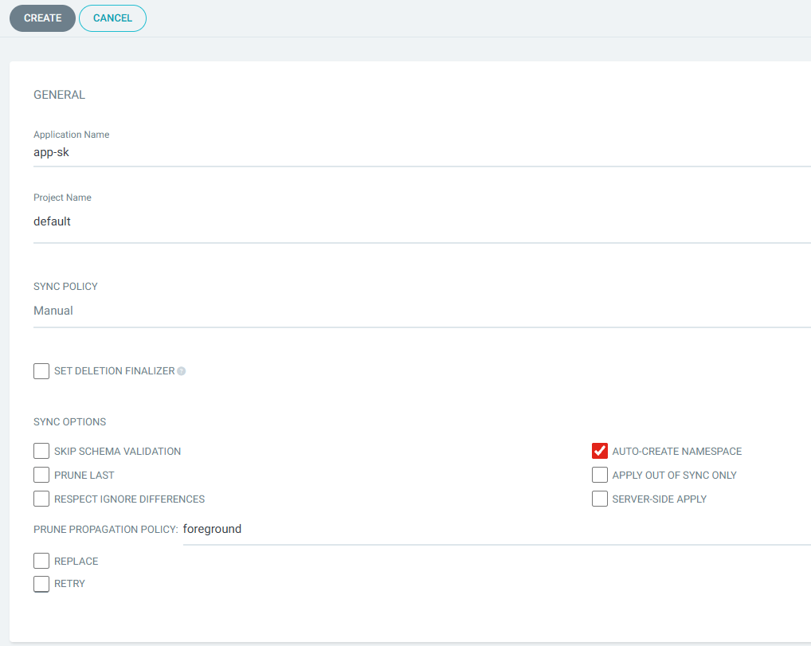

3. На вкладці **SOURCE** вказую, звідки брати маніфести:

   - **Repository URL**: `https://github.com/SvitLanaSvit/DevOps_Final_Project_2026.git`
   - **Revision**: `main`
   - **Path**: `k8s/app`

   Важливо: шлях саме `k8s/app`, без зворотних слешів і без додаткових підкаталогів.

   - 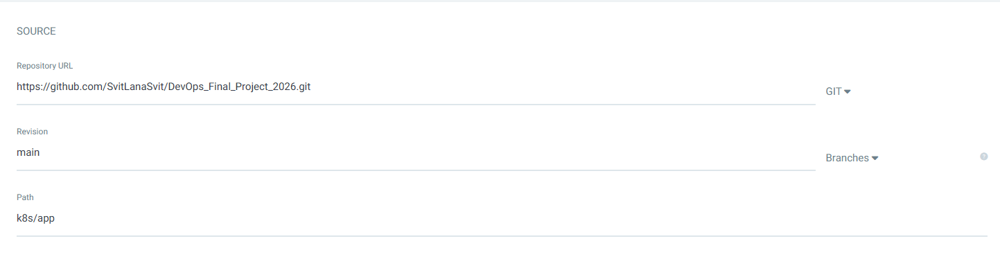

4. На вкладці **DESTINATION** вказую, куди деплоїти:

   - **Cluster URL**: `https://kubernetes.default.svc` (in-cluster Kubernetes);
   - **Namespace**: `app`;
   - ставлю галочку **`AUTO-CREATE NAMESPACE`**, щоб ArgoCD сам створив namespace `app`, якщо його ще немає.

   - 

5. Налаштування **DIRECTORY** залишаю за замовчуванням (тому що в мене звичайний набір YAML‑файлів без Helm/Kustomize).

6. Після цього натискаю **`CREATE`**.

У результаті на головному екрані ArgoCD з'являється новий застосунок `app-sk` зі статусом `OutOfSync` (маніфести ще не застосовані до кластера):

- 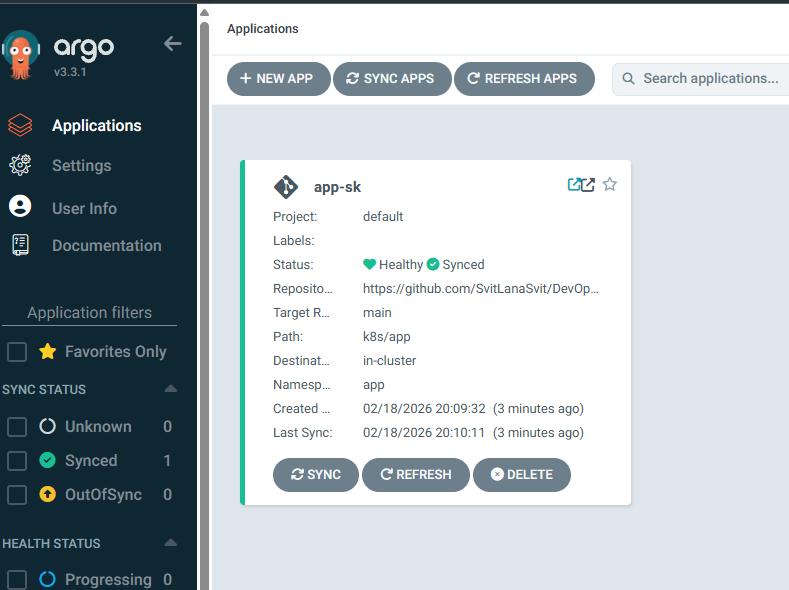

---

## 5. Перший Sync та перевірка в WSL

Щоб ArgoCD застосував маніфести в кластері, я виконую **перший ручний sync**:

1. Відкриваю застосунок `app-sk` в ArgoCD.
2. Натискаю кнопку **`SYNC`** → **`SYNCHRONIZE`**.

Після успішного sync у дереві ресурcів видно, що ArgoCD створив:

- namespace `app`;
- deployment `backend`;
- service `backend-svc`;
- ingress `backend-ingress`.

- 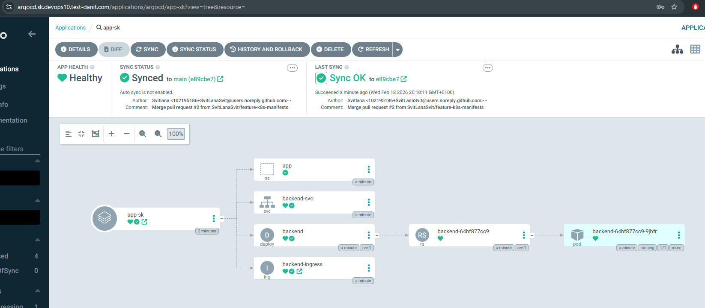

### Перевірка з WSL

У WSL я перевірила, що ресурси реально створені в кластері:

```bash
kubectl get ns
kubectl get pods -n app
kubectl get svc -n app
kubectl get ingress -n app
```

Очікування:

- існує namespace `app`;
- pod `backend-...` у статусі `Running`;
- сервіс `backend-svc` типу `ClusterIP`;
- ingress `backend-ingress` з host `app.sk.devops10.test-danit.com`.

Скріншот з WSL із результатами `kubectl`:

- 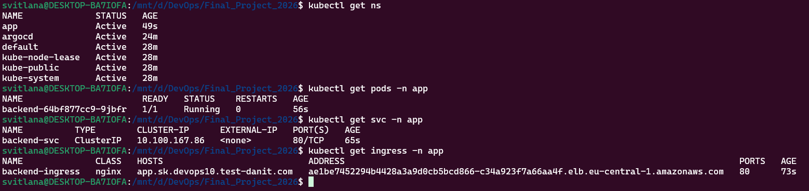

### Перевірка з браузера

Після створення ingress і оновлення DNS (external-dns), відкриваю в браузері:

- `https://app.sk.devops10.test-danit.com`

Отримую відповідь від Python backend'а з IP pod'а:

- 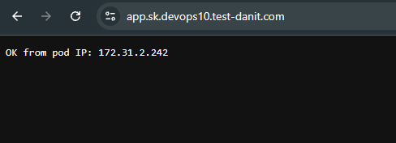

---

## 6. Увімкнення AUTO-SYNC для застосунку `app-sk`

Щоб ArgoCD **автоматично оновлював** ресурси при зміні маніфестів у Git, я включила авто‑синхронізацію.

1. У ArgoCD відкриваю застосунок `app-sk`.
2. Натискаю **`APP DETAILS`** → **`EDIT`**.
3. Перехожу на вкладку **`SYNC POLICY`**.
4. Ставлю галочку **`ENABLE AUTO-SYNC`**.

За бажанням можна додатково увімкнути:

- `PRUNE RESOURCES` — автоматично видаляти ресурси, які були видалені з маніфестів;
- `SELF HEAL` — повертати ресурси до стану з Git, якщо їх змінено напряму в кластері.

Скріншоти налаштувань AUTO‑SYNC:

- 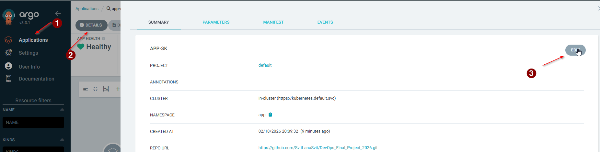
- 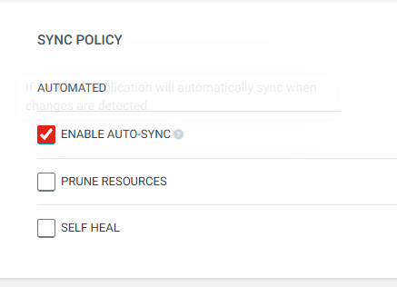

Після збереження вгорі сторінки з'являється банер, що **AUTO-SYNC увімкнено**, а в описі застосунку видно налаштовану політику синхронізації:

- 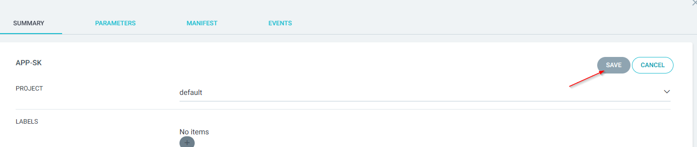

Тепер, коли стан у Git зміниться, ArgoCD сам:

- виявить, що застосунок `OutOfSync`;
- виконає sync без ручного натискання кнопки.

---

## 7. Оновлення Docker‑образу через зміну тега в `deployment.yaml`

Щоб продемонструвати GitOps‑підхід і AUTO‑SYNC, я змінила тег Docker‑образу в маніфесті Deployment.

### 7.1. Звідки береться тег образу (SHA)

Після кожного коміту в гілці `main` мій GitHub Actions workflow:

1. збирає Docker‑образ із Python backend'ом;
2. пушить його в Docker Hub як `svitlanakizilpinar/final-app` з тегами:
   - `latest`;
   - `${{ github.sha }}` — повний SHA коміту.

Подивитися SHA останнього коміту можна на сторінці репозиторію в GitHub у розділі **Commits**. Цей SHA використовує GitHub Actions як тег Docker‑образу.

### 7.2. Зміна тега образу в маніфесті

У WSL я відкрила репозиторій і відредагувала файл `k8s/app/deployment.yaml`:

```bash
cd DevOps_Final_Project_2026
code k8s/app/deployment.yaml   # або nano/vim
```

У секції контейнера змінила рядок `image` з попереднього значення, наприклад:

```yaml
image: svitlanakizilpinar/final-app:latest
```

на конкретний SHA‑тег, наприклад:

```yaml
image: svitlanakizilpinar/final-app:<новий_SHA_коміту>
```

(у моєму випадку я послідовно змінювала тег на різні SHA, які згенерував GitHub Actions).

Скріншот зміни тега образу в маніфесті:

- 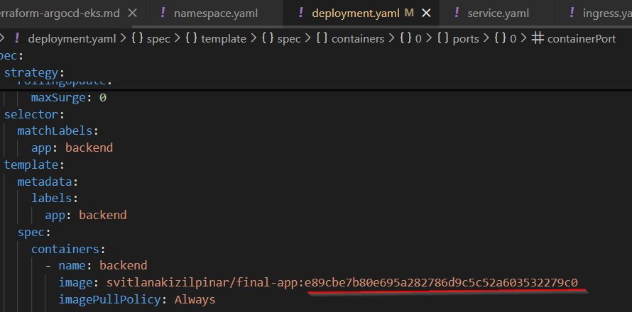

Після редагування виконую стандартні Git‑команди:

```bash
git status
git diff k8s/app/deployment.yaml
git commit -am "Change backend image tag"
git push origin main
```

У цей момент у гілці `main` з'являється новий коміт, де `deployment.yaml` посилається на інший тег Docker‑образу.

---

## 8. Як ArgoCD з AUTO-SYNC оновлює Deployment

Після пушу змін у GitHub ArgoCD автоматично:

1. виявляє, що застосунок `app-sk` став **`OutOfSync`** (маніфести в Git відрізняються від стану в кластері);
2. завдяки ввімкненому **AUTO‑SYNC** запускає синхронізацію без моєї участі;
3. оновлює Deployment `backend` у namespace `app`:
   - Kubernetes починає rolling update, стягує новий Docker‑образ з Docker Hub із відповідним SHA‑тегом;
   - створює новий pod із новим образом;
   - видаляє старий pod.

Скріншоти з ArgoCD під час цього процесу:

- 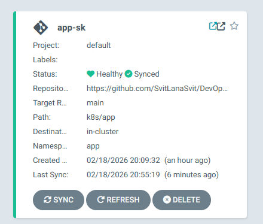
- 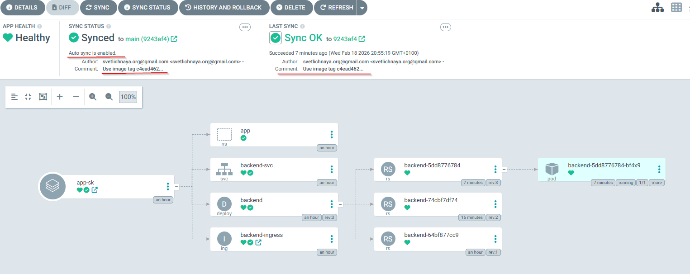

У підсумку застосунок знову переходить у статус `Healthy` та `Synced`, але вже з оновленим образом.

---

## 9. Перевірки в WSL після оновлення версії

Щоб переконатися, що оновлення реально відбулося в кластері, я виконую кілька перевірок з WSL.

### 9.1. Перевірка pod'ів

```bash
kubectl get pods -n app -o wide
```

Очікування:

- бачимо новий pod `backend-...` із новим часом створення;
- старий pod (якщо ще існує) у статусі `Terminating` або вже видалений.

### 9.2. Перевірка образу, який використовується в Deployment

```bash
kubectl describe deployment backend -n app | grep -i image
```

або

```bash
kubectl get deployment backend -n app -o yaml | grep -i image
```

У виводі має бути оновлений рядок із тегом SHA, який я вказала в `deployment.yaml`.

### 9.3. Перевірка ingress і доступу з браузера

```bash
kubectl get ingress -n app
```

Переконуюся, що ingress `backend-ingress` все ще показує host `app.sk.devops10.test-danit.com`.

Потім знову відкриваю в браузері:

- `https://app.sk.devops10.test-danit.com`

Скріншот із WSL (оновлений тег образу та IP pod'а) і з браузера з відповіддю `OK from pod IP: ...`:

- 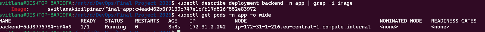
- 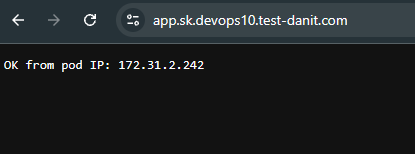

Сторінка з відповіддю backend'а завантажується, а IP pod'а може змінитися (якщо запит обробив вже новий pod).

---

## 10. Підсумок кроку 5

На цьому кроці я:

- створила ArgoCD Application `app-sk`, який бере маніфести з каталогу `k8s/app` у GitHub та застосовує їх до кластера EKS;
- один раз вручну виконала `SYNC` і переконалася через WSL (`kubectl`), що namespace, Deployment, Service і Ingress створені коректно, а застосунок доступний за `https://app.sk.devops10.test-danit.com`;
- увімкнула **AUTO‑SYNC** для `app-sk`, щоб ArgoCD самостійно оновлював кластер при зміні маніфестів у Git;
- змінила тег Docker‑образу в `k8s/app/deployment.yaml` на SHA конкретного коміту, запушила зміни в GitHub і побачила, як ArgoCD автоматично перейшов у `OutOfSync`, а потім виконав авто‑синхронізацію та rolling update в кластері;
- за допомогою команд у WSL (`kubectl get pods`, `kubectl describe deployment`, `kubectl get ingress`) перевірила, що в кластері дійсно працює оновлений образ.

Таким чином, у проєкті реалізований повноцінний GitOps‑потік: **код → Docker‑образ → маніфести в Git → ArgoCD → оновлений застосунок в EKS** з автоматичною синхронізацією змін.