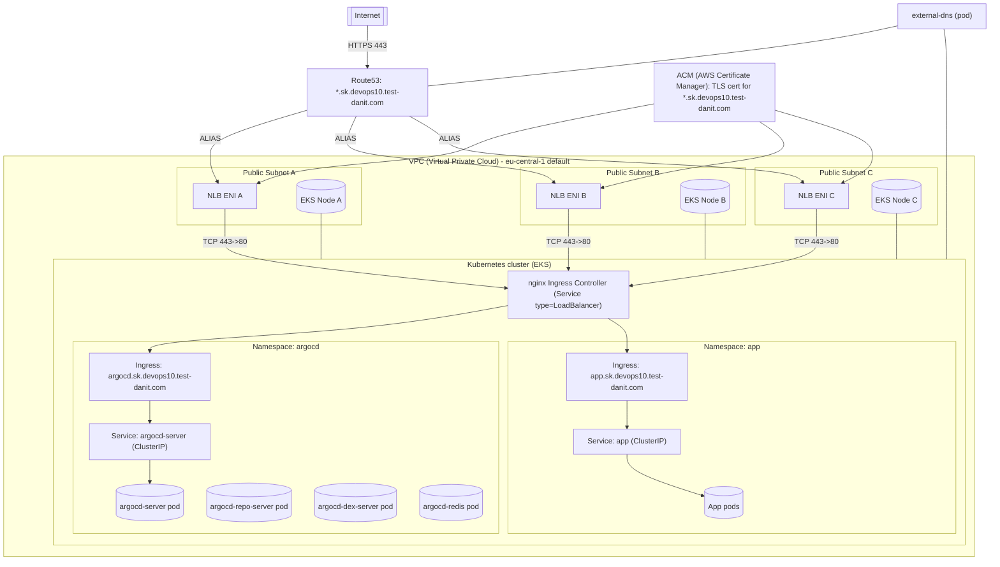

# Архітектура VPC + EKS + ArgoCD + App

```mermaid
flowchart TB
  Internet[[Internet]]

  subgraph VPC["VPC (Virtual Private Cloud) - eu-central-1 default"]

    subgraph PubA[Public Subnet A]
      NLB_A["NLB ENI A"]
      NodeA[(EKS Node A)]
    end

    subgraph PubB[Public Subnet B]
      NLB_B["NLB ENI B"]
      NodeB[(EKS Node B)]
    end

    subgraph PubC[Public Subnet C]
      NLB_C["NLB ENI C"]
      NodeC[(EKS Node C)]
    end

    subgraph K8s["Kubernetes cluster (EKS)"]
      Ingress["nginx Ingress Controller (Service type=LoadBalancer)"]

      subgraph ArgoNS["Namespace: argocd"]
        ArgoServer[(argocd-server pod)]
        ArgoRepo[(argocd-repo-server pod)]
        ArgoDex[(argocd-dex-server pod)]
        ArgoRedis[(argocd-redis pod)]
        ArgoSvc["Service: argocd-server (ClusterIP)"]
        ArgoIngress["Ingress: argocd.sk.devops10.test-danit.com"]
      end

      subgraph AppNS["Namespace: app"]
        AppPods[(App pods)]
        AppSvc["Service: app (ClusterIP)"]
        AppIngress["Ingress: app.sk.devops10.test-danit.com"]
      end
    end
  end

  Route53["Route53: *.sk.devops10.test-danit.com"]
  ACM["ACM (AWS Certificate Manager): TLS cert for *.sk.devops10.test-danit.com"]
  ExtDNS["external-dns (pod)"]

  Internet -->|HTTPS 443| Route53 -->|ALIAS| NLB_A
  Route53 -->|ALIAS| NLB_B
  Route53 -->|ALIAS| NLB_C

  ACM --> NLB_A
  ACM --> NLB_B
  ACM --> NLB_C

  NLB_A -->|TCP 443->80| Ingress
  NLB_B -->|TCP 443->80| Ingress
  NLB_C -->|TCP 443->80| Ingress

  Ingress --> ArgoIngress --> ArgoSvc --> ArgoServer
  Ingress --> AppIngress --> AppSvc --> AppPods

  NodeA --- K8s
  NodeB --- K8s
  NodeC --- K8s

  ExtDNS --- Route53
  ExtDNS --- K8s
```
